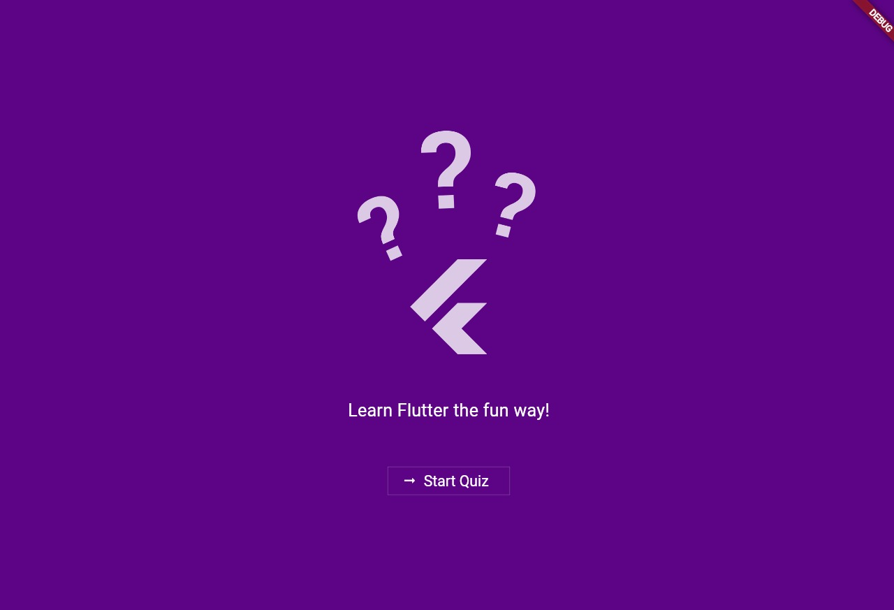
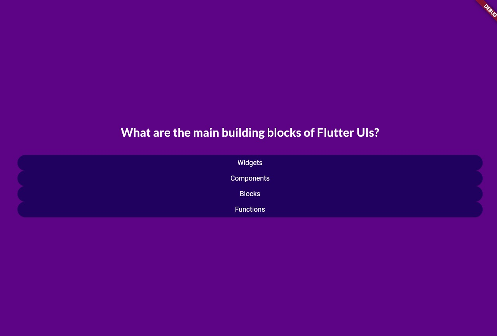
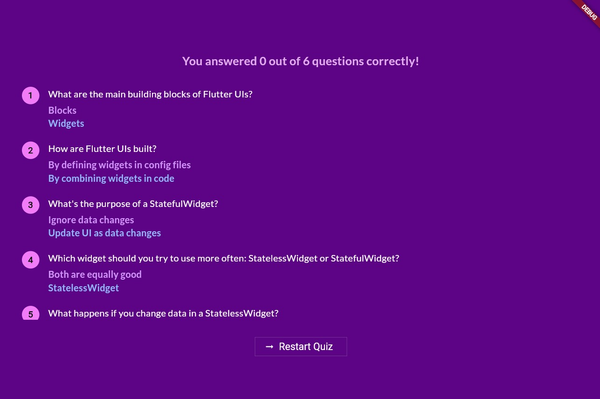
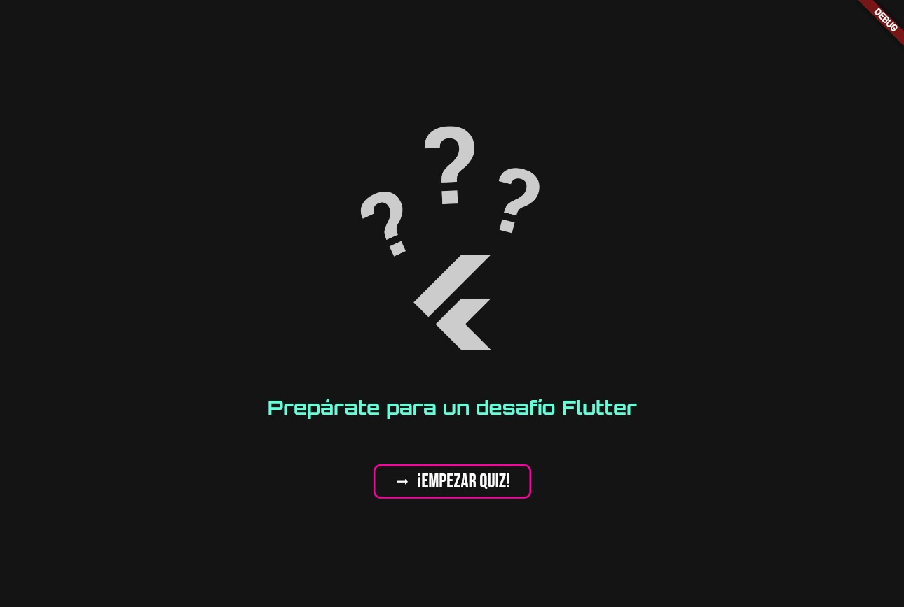
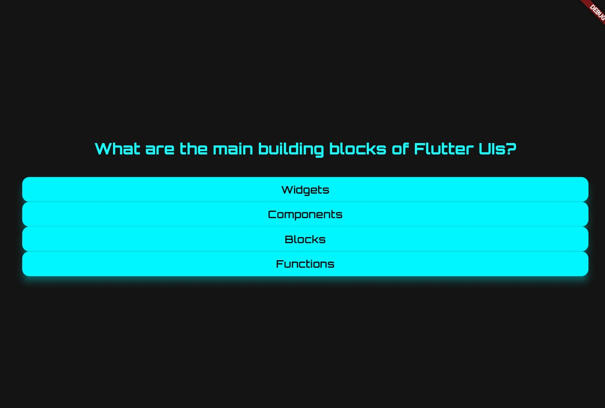
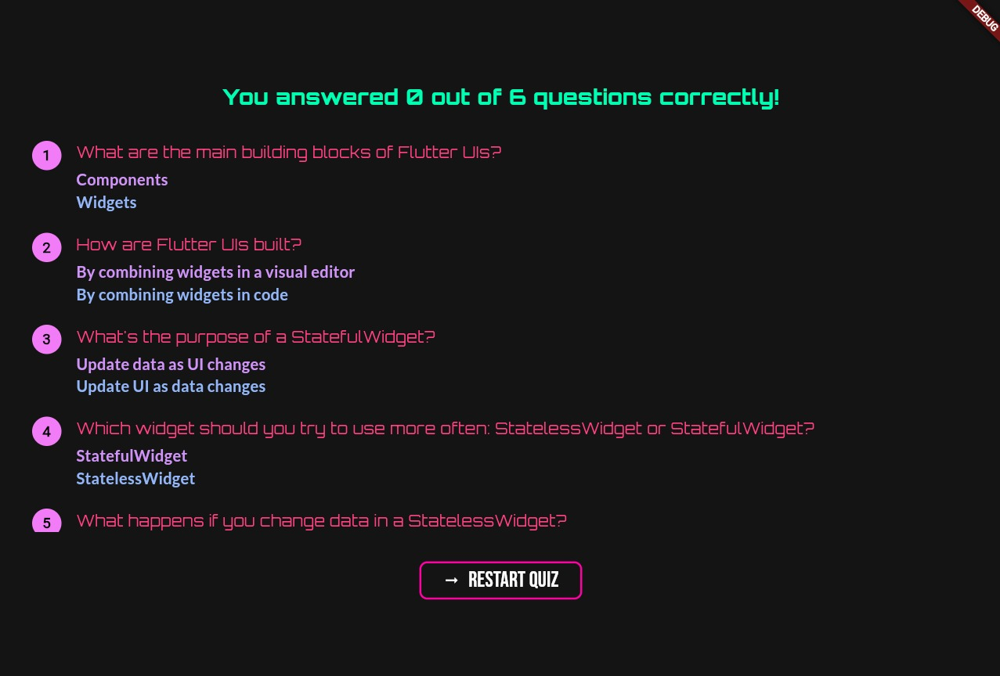

# 🎯 Flutter Quiz App — Personalización de Pantalla de Inicio

Este proyecto es una aplicación de preguntas y respuestas desarrollada con Flutter. Se ha personalizado la pantalla inicial (`StartScreen`) para mejorar su estética y darle un estilo más moderno y atractivo.

---

## ✅ Cambios Realizados

### 1. ✨ Mejora del Diseño Visual
- **Texto actualizado**:  
  Antes: `"Learn Flutter the fun way!"`  
  Ahora: `"Prepárate para un desafío Flutter"`

- **Estilo tipográfico**:  
  Se implementó la fuente **Orbitron** usando `google_fonts` para un look más tecnológico y profesional.

- **Color del texto**:  
  De blanco básico (`Colors.white`) a **`Colors.tealAccent`**, para mayor contraste y visibilidad.

- **Alineación centrada**:  
  Se agregó `Center()` para asegurar que el contenido esté perfectamente centrado vertical y horizontalmente.

---

### 2. 🔘 Botón Personalizado
- Se reemplazó `ElevatedButton` o `TextButton` por un widget personalizado: `OutlinedButtonExample`, que se adapta al nuevo estilo.

- Icono de flecha (`Icons.arrow_right_alt`) agregado para guiar al usuario visualmente hacia la acción.

- Texto del botón cambiado a:  
  **De**: `"Start Quiz"`  
  **A**: `"¡Empezar Quiz!"`

---

### 3. 🖼️ Imágenes

A continuación se muestran comparaciones visuales del diseño **antes** y **después** de los cambios.

---

## 📸 Comparación Visual

### Antes

| Imagen 1 | Imagen 2 | Imagen 3 |
|---------|---------|---------|
|  |  |  |

### Después

| Imagen 1 | Imagen 2 | Imagen 3 |
|---------|---------|---------|
|  |  |  |

> 📌 Coloca tus capturas de pantalla en una carpeta llamada `screenshots/` dentro del directorio raíz del proyecto.

---